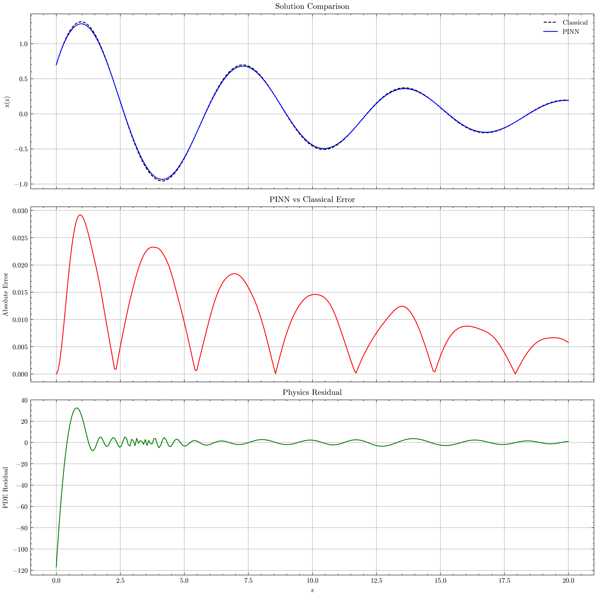

# 🧠 Physics-Informed Neural Network for Damped Harmonic Oscillator

This repository contains the implementation of a **Physics-Informed Neural Network (PINN)** to solve the **damped harmonic oscillator** ODE, as part of the test task for the **GSoC 2025 project: _Physics-Informed Neural Network Diffusion Equation (PINNDE)_** under the _Machine Learning for Science_ category.

## 📘 Problem Statement

We aim to solve the following second-order ordinary differential equation (ODE):

$$
\frac{d^2x}{dz^2} + 2\xi \frac{dx}{dz} + x = 0
$$

Subject to initial conditions:
- $x(0) = 0.7$
- $\frac{dx}{dz}(0) = 1.2$

The PINN is conditioned on the damping ratio $ \xi \in [0.1, 0.4] $, and we aim to solve this over the domain $ z \in [0, 20] $.

---

## 🛠️ Tools & Frameworks

- **Language**: Python 3.12+
- **Deep Learning**: PyTorch
- **Math & Plotting**: NumPy, Matplotlib
- **Training Utilities**: L-BFGS optimizer, Adam

---

## 📈 PINN Overview

A Physics-Informed Neural Network (PINN) is trained to satisfy:
- The governing differential equation
- The initial conditions
- Physics-based regularization (residual minimization)

### Input:
- $ z $: domain variable
- $ \xi $: damping ratio (treated as a conditioning input)

### Output:
- $ x(z, \xi) $: predicted position at a given time and damping

## 📊 Results

- **Mean Squared Error (MSE)**: `~1e-4` (varies slightly with damping)
- **Physics Residuals**: Minimized across domain
- **Visual Match**: PINN predictions closely match the analytical solution

  

---

## 🧠 Future Improvements

- Incorporate uncertainty estimation (Bayesian PINNs)
- Extend to partial differential equations
- Integrate reverse-time diffusion equation solvers (project direction)

---

## 👤 Author

**Sagar Prakash Barad**  
📧 [sagarbarad118@gmail.com](mailto:sagarbarad118@gmail.com)  
🔗 [LinkedIn](https://www.linkedin.com/in/sagar-prakash-barad-b6114a201/) | [GitHub](https://github.com/SagarPrakashBarad)

---

## 📄 License

MIT License. Feel free to use and cite if helpful.

---
